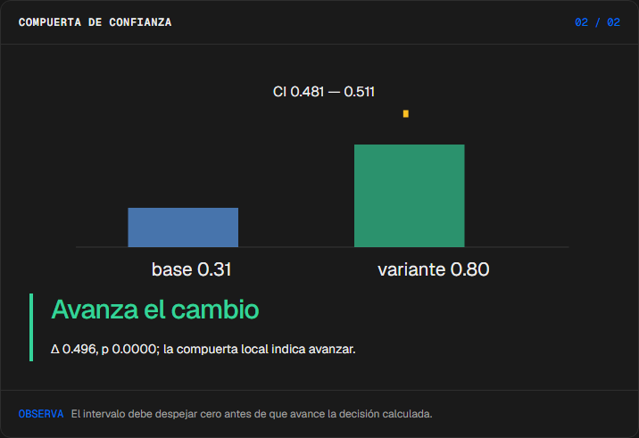
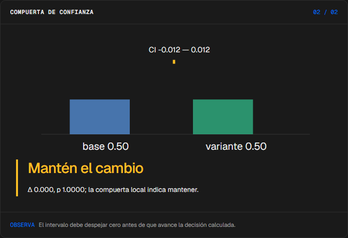
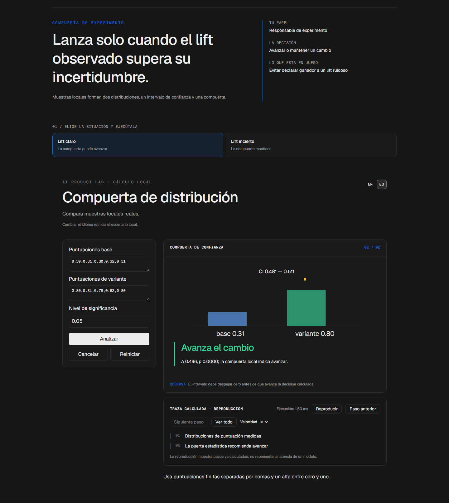

# Ensayo

<!-- community-badges -->
[](https://github.com/mdeasis27/ensayo/actions/workflows/ci.yml) [](LICENSE)
<!-- /community-badges -->

[English](README.md) · [Probar demo](https://ensayo-manueldeasis27-2515s-projects.vercel.app/es/app) · [Caso de estudio](https://portafolio-mdea.vercel.app/es/projects/ensayo) · [Código](https://github.com/mdeasis27/ensayo)


Edita muestras de puntuación y nivel de significancia para comparar mejora e intervalos de confianza.

## Dos situaciones para comparar

**Lift claro:** Mejor resultado de variante La compuerta puede avanzar.



**Lift incierto:** Resultados solapados La compuerta mantiene.



## Caso de uso de negocio

Un lift sin incertidumbre puede llevar a lanzar demasiado pronto.

**Quién lo usa:** Responsable de experimento.

**La decisión:** Avanzar, mantener o detener un cambio.

Elige un experimento, calcula distribuciones e intervalo y lee la compuerta.

### Prueba la decisión

**Lift claro:** Mejor resultado de variante La compuerta puede avanzar.

**Lift incierto:** Resultados solapados La compuerta mantiene.

Elige un escenario, modifica sus controles y ejecuta el cálculo local. Avanza por la visualización paso a paso o revela todo. Reinicia antes de comparar el segundo escenario.

## Cómo probarlo

Abre `/en/app` (inglés, por defecto) o `/es/app` (español). Cambia los datos del escenario y ejecuta el cálculo. Inspecciona la decisión, evidencia y traza calculada. La reproducción revela pasos locales ya completados; no mide un modelo en vivo. Reiniciar empieza un escenario local nuevo. Cambiar de idioma reinicia el escenario.

La demo principal no requiere cuenta, clave de API ni base de datos. Los enlaces públicos apuntan al despliegue existente; el rediseño local está pendiente de publicación.

<!-- recruiter-mission:start -->
### Tu misión interactiva

Carga las muestras de mejora al límite, elige alfa antes de ejecutar, predice opcionalmente avanzar/mantener/revertir y analiza para revelar ambas compuertas.

Calcula una prueba de Welch con las mismas muestras a alfa 0.01 y 0.10. La diferencia observada es 0.15 y p es aproximadamente 0.022 en este reto ilustrativo: mantener con 0.01 y avanzar con 0.10. Las medias y p no cambian; sí cambian los intervalos y decisiones.

**Por qué este enfoque:** La estadística local real separa mejora observada e incertidumbre. Alfa debe elegirse antes de observar resultados; la comparación es análisis de sensibilidad, no permiso para elegir la compuerta que aprueba.

**Antes de producción:** Definir alfa y efecto mínimo útil de antemano; validar muestreo, independencia, tamaño de muestra, pruebas múltiples y límites de impacto al usuario. Significancia estadística no demuestra valor empresarial.

Editar datos, elegir un escenario o reiniciar borra la predicción y los resultados anteriores. La comparación aparece al completar la reproducción; las demos principales no requieren cuenta ni llave.

El piloto de misiones actualiza esta implementación. Las capturas e informes de navegador existentes documentan la etapa anterior; las comprobaciones de interacción y capturas nuevas están pendientes por bloqueos del entorno actual.
<!-- recruiter-mission:end -->

## Instalación y verificación local

Requiere Node.js 22 y pnpm 10.

```sh
pnpm install --frozen-lockfile
pnpm dev
pnpm test
node node_modules/typescript/bin/tsc --noEmit --incremental false
pnpm lint
pnpm build
```

Abre `http://localhost:3000/en/app`. La validación registrada cubre pruebas, lint, TypeScript y builds de producción. Consulta los [resultados de comandos](docs/quality/decision-lab-verification.json) y las [comprobaciones de componentes en navegador](docs/quality/decision-lab-browser.json). Estas pruebas usan componentes React y CSS de producción con navegación de idioma controlada; no certifican rutas de Next ni el despliegue público.

## Arquitectura

- `app/[lang]/`: experiencia web por idioma.
- `lib/experience/`: adaptador local tipado, validación y trazas.
- `design-system/`: tokens visuales, controles de idioma y presentación de ejecución y reproducción.
- `app/api/`: integraciones opcionales de servidor; la demo principal no las requiere.

Tecnología: Next.js 16, TypeScript, Python, Vitest, pytest, Tailwind CSS v4.

## Evidencia y límites

Dos distribuciones se encuentran en una compuerta.

Distribuciones calculadas y decisiones de avanzar o esperar; explica muestras inválidas o insuficientes.

Conecta incertidumbre con una decisión de lanzamiento.

**Límites:** Las muestras son ilustrativas; la estadística de Welch se calcula localmente. Las pruebas indefinidas se rechazan. Estos prototipos de portafolio no afirman impacto medido en producción.

Los datos son ejemplos ficticios o anónimos. Las integraciones opcionales requieren sus propias credenciales y configuración. Los secretos pertenecen al gestor configurado, nunca a archivos locales de secretos ni Git. Usa el flujo existente `infisical run -- <command>` si necesitas integraciones en vivo. La demo local no publica ni despliega automáticamente.



<!-- community-section -->
## Licencia y contribución

Publicado bajo la [licencia MIT](LICENSE). Se aceptan issues y pull requests: lee antes [CONTRIBUTING.md](CONTRIBUTING.md) y el [Código de Conducta](CODE_OF_CONDUCT.md). Para reportar una vulnerabilidad, consulta [SECURITY.md](SECURITY.md).
<!-- /community-section -->
