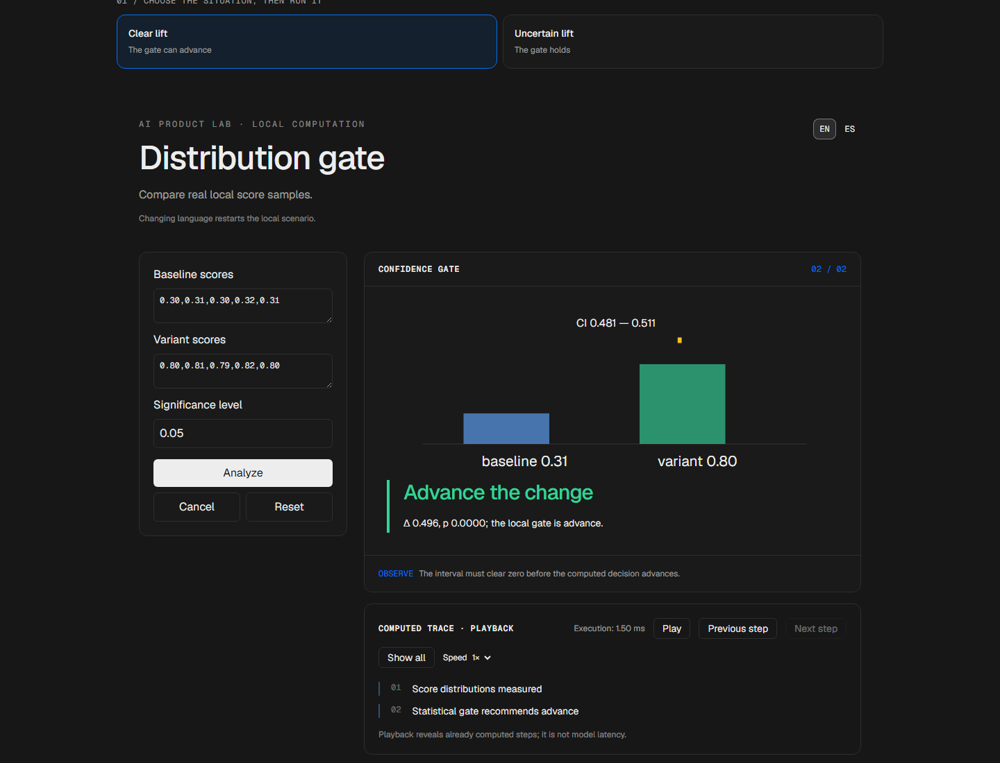
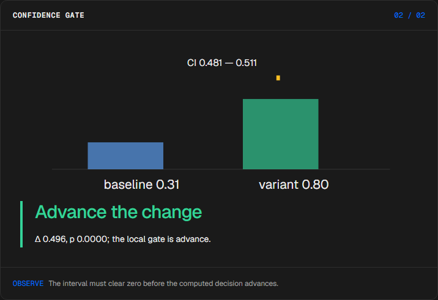
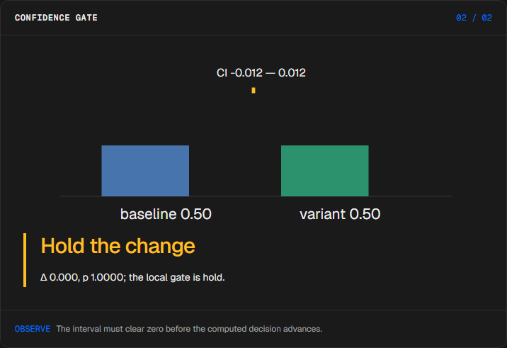
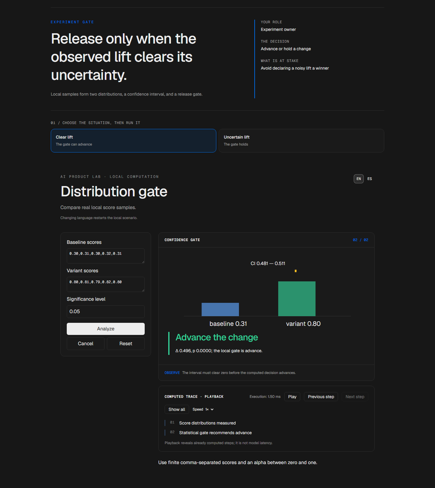

# Release evidence

<!-- community-badges -->
[](https://github.com/mdeasis27/ensayo/actions/workflows/ci.yml) [](LICENSE)
<!-- /community-badges -->

[Español](README.es.md) · [Try the demo](https://ensayo-manueldeasis27-2515s-projects.vercel.app/en/app) · [Case study](https://manueldeasis.com/en/projects/ensayo) · [Source](https://github.com/mdeasis27/ensayo)



Edit score samples and significance level to compare lift and confidence intervals.

## Two situations to compare

**Clear lift:** Higher variant outcome The gate can advance.



**Uncertain lift:** Overlapping outcomes The gate holds.



## Business use case

A lift without uncertainty can lead to a premature release.

**Who uses it:** Experiment owner.

**The decision:** Advance, hold, or stop a change.

Choose an experiment preset, calculate distributions and confidence interval, then read the gate.

### Try the decision

**Clear lift:** Higher variant outcome The gate can advance.

**Uncertain lift:** Overlapping outcomes The gate holds.

Choose a scenario, edit its controls and run the local computation. Step through the visual process or reveal all steps. Reset before comparing the second scenario.

## How to try it

Open `/en/app` (English, default) or `/es/app` (Spanish). Change the scenario inputs and run the computation. Inspect the resulting decision, evidence and computed trace. Playback reveals completed local steps; it does not measure a live model. Reset starts a new local scenario. Changing language resets the scenario.

The primary demo needs no account, API key or database. Public links refer to the existing deployment; local redesign changes are pending publication.

<!-- recruiter-mission:start -->
### Your interactive mission

Load the borderline-improvement samples, choose alpha before execution, optionally predict advance/hold/rollback, then analyze and reveal both gates.

Compute a Welch test on identical samples at alpha 0.01 and 0.10. The observed difference is 0.15 and p is about 0.022 in this illustrative challenge: hold at 0.01 and advance at 0.10. The means and p-value remain fixed; confidence intervals and decisions change.

**Why this approach:** Real local statistics separate observed improvement from uncertainty. Alpha must be chosen before observing results; this comparison is sensitivity analysis, not permission to choose the gate that passes.

**Before production:** Predefine alpha and minimum useful effect; validate sampling, independence, sample size, multiple testing and user-impact guardrails. Statistical significance does not establish business value.

Editing inputs, choosing a preset or resetting clears the prediction and obsolete results. Comparisons appear only at completed playback; the primary demos need no account or key.

The mission pilot updates this implementation. Existing screenshots and browser reports document the previous stage; fresh browser interaction checks and captures are pending because the current environment blocked them.
<!-- recruiter-mission:end -->

## Local setup and verification

Requires Node.js 22 and pnpm 10.

```sh
pnpm install --frozen-lockfile
pnpm dev
pnpm test
node node_modules/typescript/bin/tsc --noEmit --incremental false
pnpm lint
pnpm build
```

Open `http://localhost:3000/en/app`. Recorded validation covers tests, lint, TypeScript and production builds. See [command results](docs/quality/decision-lab-verification.json) and [browser component checks](docs/quality/decision-lab-browser.json). The new browser checks exercise real React components and production CSS with controlled locale navigation; they do not certify Next routes or public deployment.

## Architecture

- `app/[lang]/`: localized browser experience.
- `lib/experience/`: typed local adapter, validation and run traces.
- `design-system/`: shared visual tokens, locale controls and execution/replay presentation.
- `app/api/`: optional server integrations; the primary demo does not require them.

Technology: Next.js 16, TypeScript, Python, Vitest, pytest, Tailwind CSS v4.

## Evidence and limitations

Two distributions meet at a confidence gate.

Computed distributions and advance/hold decisions; invalid or insufficient samples are explained.

Connects uncertainty to a concrete release choice.

**Limits:** Sample data is illustrative; Welch statistics are calculated locally. Undefined tests are rejected. These portfolio prototypes do not claim measured production impact.

Inputs use fictional or anonymized examples. Optional live integrations require their own credentials and operational setup. Secrets belong in the configured secret manager, never in local secret files or Git. Use the existing `infisical run -- <command>` workflow when live integration is needed. This repository does not publish or deploy automatically as part of the local demo.



<!-- community-section -->
## License and contributing

Released under the [MIT License](LICENSE). Issues and pull requests are welcome: read [CONTRIBUTING.md](CONTRIBUTING.md) and the [Code of Conduct](CODE_OF_CONDUCT.md) first. To report a vulnerability, see [SECURITY.md](SECURITY.md).
<!-- /community-section -->
